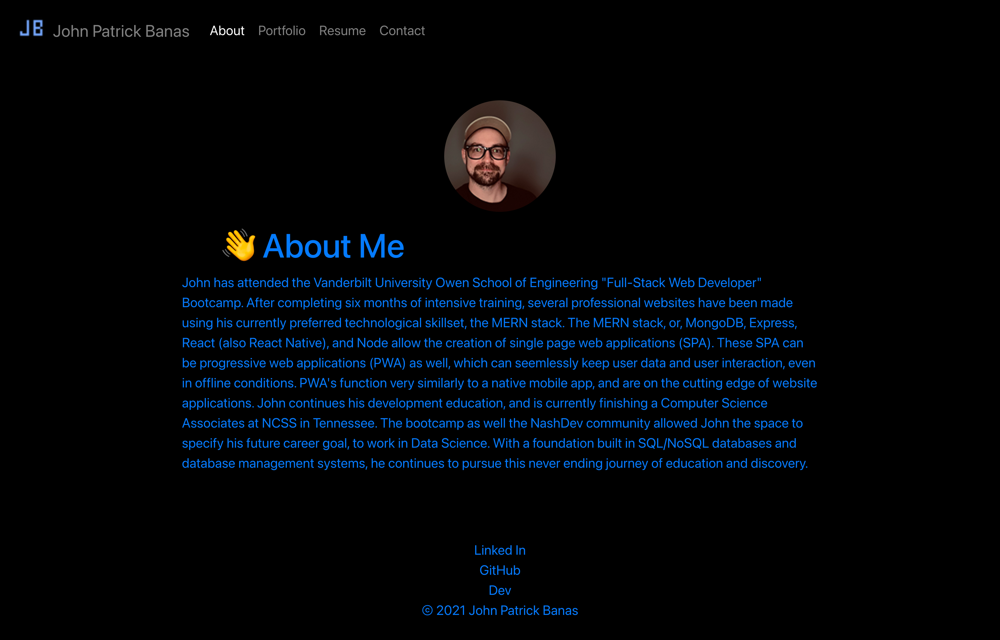
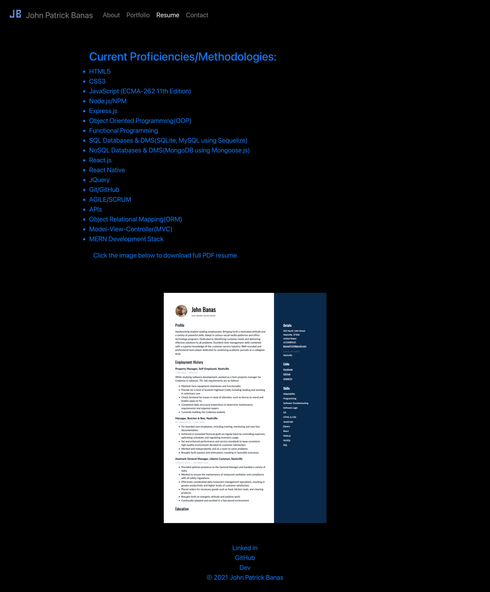
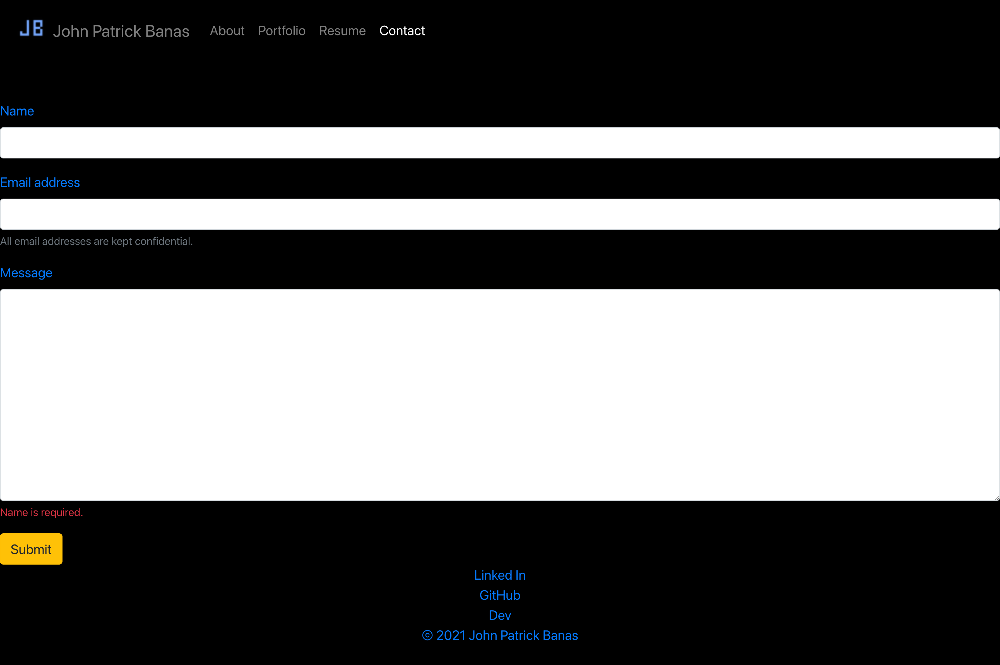

<h1 id="title">🎉 My React Profile 🎉</h1>

A portfolio made with `React.js` to showcase some of my favorite projects and the technologies used to make them. 

<h2>Table of Contents 📚<h2>
* [Navigation](#Navigation)
* [About](#about)
* [Portfolio](#portfolio)
* [Resume](#resume)
* [Contact](#contact)
* [Footer](#footer)
* [Live Deployment](#deployed)
* [Built With](#built)
* [Future Updates](#future)
* [Author](#author)
* [Contributions](#contribute)
* [Give Support](#Support)

<h2 id="Navigation">Navigation 🚆</h2>

When you first go to my portfolio page you can see a navigation bar and the `About` page is the default selection. The `About` nav link is highlighted showing the active link and page. Any link clicked from the navigation bar will display the page instantly with no reload of the browser window. Ahhhhh the beauty of `React`. 🤤

&nbsp

<h2 id="about">About Me 😊</h2>

In the `About` section you will find a little bit of information that describes the technology stack I work with, as well as future goals. 

&nbsp

&nbsp

<h2 id="portfolio">Portfolio 💼</h2>

In the `Portfolio` section you are presented with six of my favorite projects. The Coding Quiz, Weather Dashboard, Motivation Manager, Tech Blog, Password Generator, and Horiseon Landing Page. The projects have titles, images of the project landing page, links to the deployed application, and links to the GitHub repositories.

&nbsp

&nbsp

<h2 id="resume">Resume 📋</h2>

`Resume` will link to the different technologies I am familiar with and a image of my resume. The image of the resume is also a downloadable PDF. 

&nbsp

&nbsp

<h2 id="contact">Contact 📬</h2>

The `Contact` section has a form with inputs for a name, email address, and message. There are validation checks to make sure that none of the inputs are left blank and that the email is in the correct format. In the example image I clicked in the name input then out of it without any input. You can see that the red text at the bottom alerts someone they need to enter in some data into that input. It will display the message dynamically based on which input field is invalid.

&nbsp

&nbsp

<h2 id="footer">Footer 👞</h2>

The footer at the bottom of the page is visible no matter which link you choose. It has links to my GitHub account, my Linked In, and my Dev account as well.

&nbsp

<h2 id="deployment">Live Deployment 😊</h2>

To see this portfolio for yourself simply click the link below:

[https://johnbanas.github.io/new_portfolio/](https://johnbanas.github.io/new_portfolio/)

&nbsp

<h2 id="built">Built With 🛠️</h2>

<ul>
<li><strong>React</strong></li>
<li><strong>JSX</strong></li>
<li><strong>React-Bootstrap</strong></li>
<li><strong>JavaScript</strong></li>
</ul>

&nbsp

<h2 id="future">Future Updates ⏳</h2>

<ul>
<li>[ ] Connect front-end to back-end technology to allow functional `Contact Form`. Currently non-functional.</li>
<li>[ ] Create a Modal system or Carousel for the different projects.</li>
<li>[ ] Create a fade in and out gallery of images showing my life in the about me section, as a Hero image.</li>
</ul>

&nbsp

<h2 id="author">Author 👋</h2>

**John Patrick Banas**

- [GitHub Profile 🖥️](https://github.com/JohnBanas)
- [Email 📧](mailto:jbanas9124@gmail.com)
- [Portfolio 💼](https://johnbanas.github.io/portfolio/)

&nbsp

<h2 id="contribute">Contributions 💚</h2>

None of this would be possible without the love and support of my wife Sam and our dog Teddy. Thank you to my nephew Mitchell for letting me help him with his homework, and discover that I actually love computer science, I just never knew. The wonderful folks at the Vanderbilt Owen School of Engineering Bootcamp. All the Instructors, TA's, Graders, Tutors, and Admin team who made my journey possible. Also to all the coders out there who teach me something new everyday, through Slack, StackOverflow, GitHub, Dev, Codecademy, Coursera, CodeNewbie, Udemy, Dataquest, and too many others to name here. I am grateful for the knowledge freely given, and I will freely give knowledge in return. Thank you most of all, to <strong><em>YOU</em></strong> for reading this far! <strong>👏 🤣</strong>

&nbsp

<h2 id="support">Give Support 👏</h2>

If you would like to contribute, have any commentary, corrections, or suggestions, please feel free to contact me through my email provided in the Author section. If you like the project, I would appreciate giving a ⭐ in support.

[Back To Top of Page](#title)

